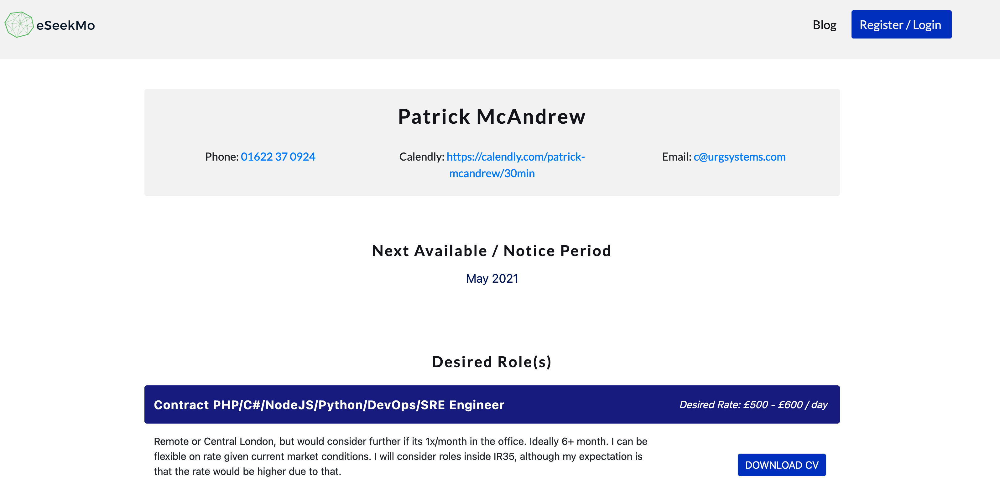
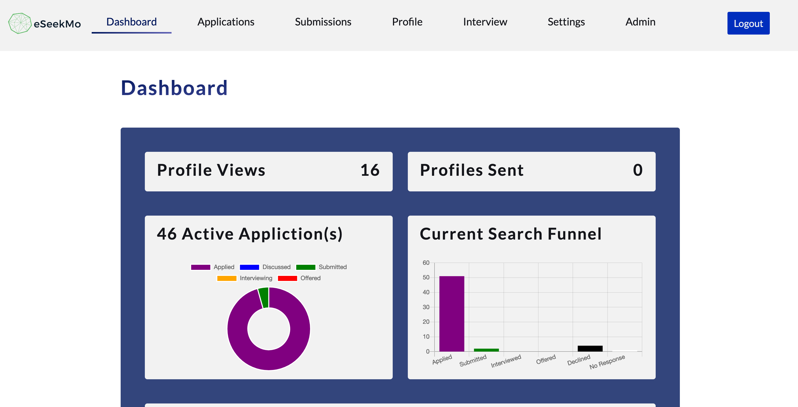



## Key Technologies:


## Company Intro:

eSeekMo is an idea I had to help streamline processes and workflows when communicating with recruiters. There are several application tracking systems (ATS) available for companies, however, I was not able to find a similar product that helped candidates. 

## Team Composition & My Role:

eSeekMo is my own project.  I did the initial site in react/redux and later worked with a junior front-end developer to improve the 
look of the site.

## Functionality:

There are several aspects of the job seeking process that eSeekMo addresses.

### Job Fit

The typical process to determine job fit is something like this:
a) Recruiter reaches out to job seeker via email, or LinkedIn.
b) Job Seeker responds that potentially they may be interested and sends over their cv.
c) Recruiter calls up to speak with candidate. This often takes 20 minutes and often results in a decision that this isn't quite the right fit due to factors such as rate, location, etc.

eSeekMo offers a candidate profile. If used, then the candidate can upload their CV along with details of the type of role, location, and pay they are interested in. Multiple role with different cvs can be utilized. This allows the candidate to simply pass along their profile link to a recruiter, who can then quickly determine if its something that may be suitable, download the cv they require and get in contact. 

### Applications, Submissions, & Metrics

eSeekMo can help to track your job applications and submissions, either by manually entering the details of a job you applied for, or by forwarding a confirmation email to the eSeekMo system. Once a recruiter has confirmed that they have submitted your profile to the company, you can mark that application as submitted to help track duplicate submissions to the same company, which may disqualify you.

You then will get nice metrics and graphs about your job searching funnel.

