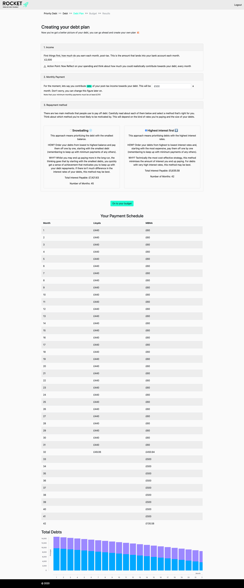



## Key Technologies:

    
## Company Intro:

[Go Fund Yourself](https://www.gofundyourself.co/) is a brand that is committed to helping Millennials reduce their debt. 

## Team Composition & My Role:

My role was as a sole developer to work with the founder to create the MVP.

## Brief:

Go Fund Yourself created a paper based workbook designed to help people understand their financial situation, create budgeting techniques, and help people climb out of debt. The workbook was a low cost MVP and GFY wanted to take the learnings from that to create a digital solution to help their users.

## Project Details:

I worked with GFY to definite what their digital MVP would look like. I then created a web based debt calculator and a basic budgeting tool along with user authentication. 

## Debt Calculator MVP:

