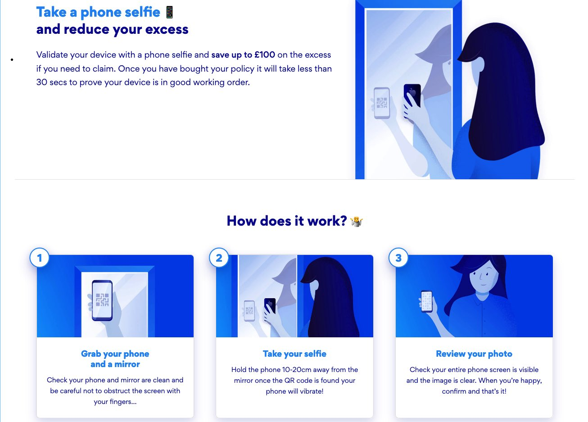



## Key Technologies:

    
## Company Intro:

so-sure is a startup MGA offering mobile phone insurance direct to consumers.

## Team Composition & My Role:

I was the first technical hire at so-sure. I created the majority of the backend systems and api, along with all of the infrastructure. I hired the technical team, including 2 native app developers, 1 front-end dev, & 2 backend developers. I worked closely with the MD, Head of Product, & Head of Marketing as well as the underwriter and the claims team. 

## Project Details:

My time at so-sure went through several stages and some of the notable projects are listed below.

#### App MVP

Initially my focus at so-sure was on creating the MVP. Together with the product owner, we decided on an app first approach. I hired the app developers, and created the backend for the initial product (architecture, infrastructure, api, and admin portal). I also sourced & integrated the the payment provider as well as the anti-fraud & device checking service. I spent quite a bit of time working with our underwriter and claim handlers to define & implement the data exchange, and perform the integration testing.

#### Web Purchase, Analytics, & A/B Testing

After MVP launch, we quickly discovered that mobile first did not work well for acquiring customers. We implemented a web based purchase flow. During this time, we were focusing on growth and implemented Mixpanel tracking and A/B testing to rapidly iterate on new ideas. 

#### pic-sure

One big problem we noticed was that we had a high number of claims raised almost immediately after purchase. Unlike other mobile insurance companies (often a 14 day wait period), we believed you should be covered from day 1. After a failed experiment using tracing across the screen, we tried a phone selfie mechanism to send photos of the mobile device to our backend. We could examine the photos and see if the screen was cracked and reduce the excess considerably if the screen was not cracked. After initial implementation, we noticed that there were various attempts to circumvent the process and so implemented quite a few difference safeguards to avoid people being able to game the system. We setup a process to eventually be able to use machine learning to automatically detect the cracked screens, but did not have enough data to run the process. We also filed a patent on the system. My role in this was as product owner and we reduced claims by over 50% using pic-sure.

## Pic-sure product info

