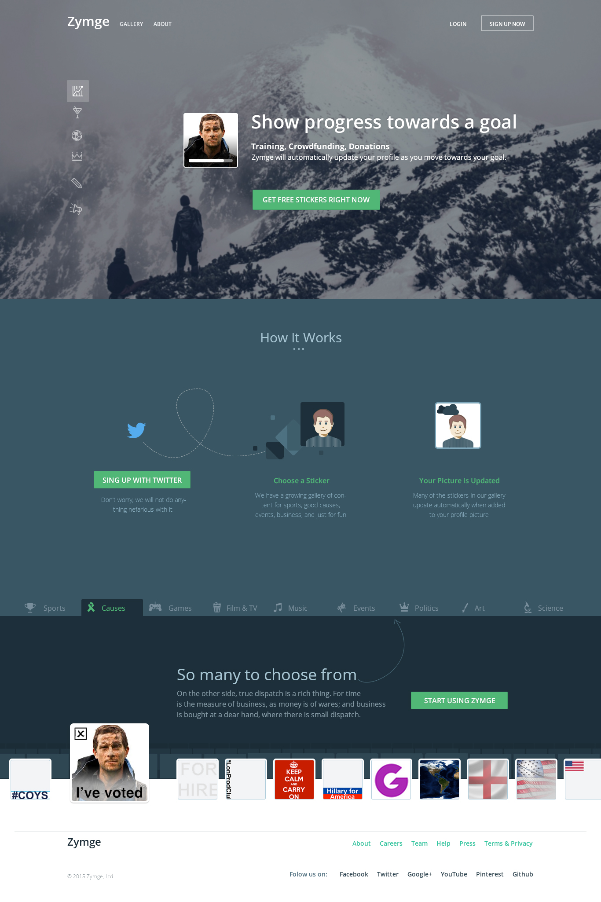
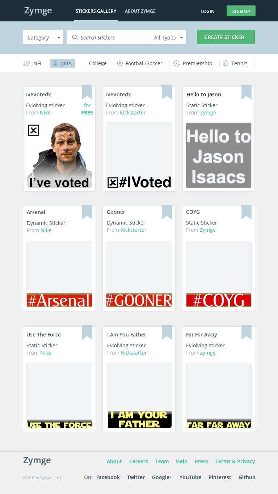
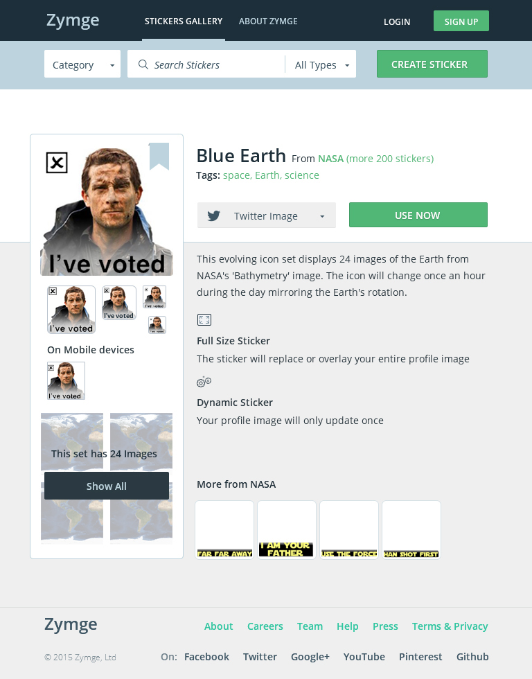
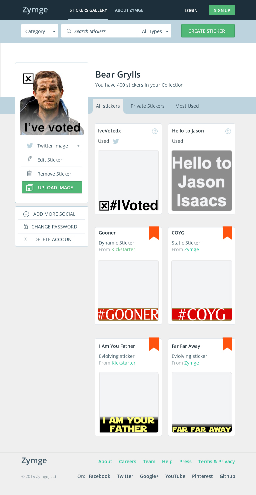



## Key Technologies:


## Company Intro:

Zymge was a site that allowed users to easily change their profile image for social media. The original image was kept allowing users to swap to any sticker image they wanted, or allow for data driven stickers to be generated (e.g. putting a stock price that changes every hour). Stickers were moderated by Zymge and it was hoped that premium stickers by businesses would generate revenue.

## Team Composition & My Role:

I was a co-founder and sole developer at Zymge. 

## Project Details:

When I started with Zymge, there was a Wordpress site with some images that didn't really work. I used the site purely as a concept and wrote a new site using Node.js. I created several data generated stickers.

## Website:
**Note these are design images (site is no longer available), however the site looked and worked very similar to these**

